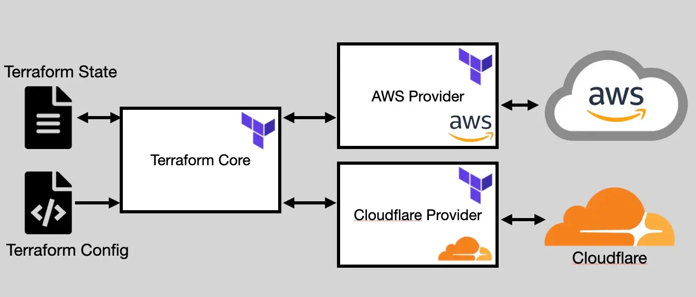

# Terraform Intro — What It Is, Why It Matters, How It Fits

> **Course:** DevOps Directive — Terraform: Beginner to Pro  
> **Section:** Part 2A (Terraform Overview)  
> **Goal:** Understand Terraform as a *system* before touching setup/commands.

> **Date:** 01/02/2026

---

## 1) What is Terraform?

HashiCorp definition:
- **Terraform is a tool for building, changing, and versioning infrastructure safely and efficiently.**

Meaning:
- You define infrastructure as **configuration files** (IaC).
- Terraform reads your desired configuration and manages real resources by talking to APIs (through providers).
- The outcome is **predictable infrastructure changes** you can review and repeat.

---

## 2) Why Terraform exists (the real reason)

Terraform exists because we want to apply **software engineering practices** to infrastructure:

- **Version control** for infra changes (Git history = who/what/why)
- **Code review** for infra (PR review instead of “someone clicked something”)
- **Consistency** across environments (dev/stage/prod)
- **Auditability** and reproducibility (infra becomes explainable)

> Terraform makes infrastructure changes feel like software changes: reviewed, tracked, repeatable.

---

## 3) Terraform’s superpower: Cloud-agnostic + API-based

Terraform can work with:
- multiple clouds (AWS/Azure/GCP)
- and many third-party services (anything with an API + provider support)

This matters when:
- you use services outside your “main” cloud (e.g., DNS providers, SaaS tools)
- you want freedom to move or span across providers

---

## 4) Terraform is not the whole DevOps stack

Terraform is **provisioning-focused**:
- It creates/manages cloud resources (networks, servers, databases, buckets, IAM, etc.)
- It does *not* primarily manage what happens *inside* servers at runtime.

So Terraform is commonly paired with other tools:

### Pattern A — Terraform + Configuration Management (Ansible)
- Terraform provisions VMs
- Ansible installs software + configures dependencies inside those VMs
- Useful when servers are long-lived or you’re doing traditional VM-based setups

### Pattern B — Terraform + Image Templating (Packer)
- Packer builds a machine image (AMI) that already has dependencies (and maybe the app) baked in
- Terraform provisions servers from that image
- Aligns with immutable infrastructure (replace instead of patching)

### Pattern C — Terraform + Orchestration (Kubernetes)
- Terraform provisions the Kubernetes cluster (e.g., EKS)
- Kubernetes manages application deployment and lifecycle on that cluster
- Clean separation:
  - Terraform defines **infrastructure**
  - Kubernetes defines **application runtime**

> Terraform defines **what infrastructure exists**.  
> Other tools define **what runs on it**.

---

## 5) Terraform mental model (high-level)

Terraform takes:
- your **desired infrastructure configuration**
- and the **current known state of what exists**
…and computes what must change so reality matches your configuration.

The key idea:
- Terraform is **state-driven** and **diff-based**.
- Changes should feel reviewable and predictable.

---

## 6) Key takeaways (what to remember from the intro)

- Terraform is IaC that enables software-dev workflows for infrastructure.
- Terraform’s value is **confidence + repeatability**, not “faster clicking.”
- Terraform is provisioning-focused, so it pairs naturally with Ansible/Packer/Kubernetes.
- Cloud-agnostic design matters when infrastructure spans multiple services/providers.

## Terraform Architecture:

Terraform consists of two main components:

### 1. Terraform Core:

The engine that processes configuration files and manages the Terraform state file.
Responsible for interacting with cloud provider APIs to make the current state match the desired configuration.

### 2. Terraform Providers:

Plugins for Terraform Core that allow it to interact with specific cloud providers and services.
Map configuration and state information to the appropriate API calls.
Over 100 providers available for various cloud providers and services.