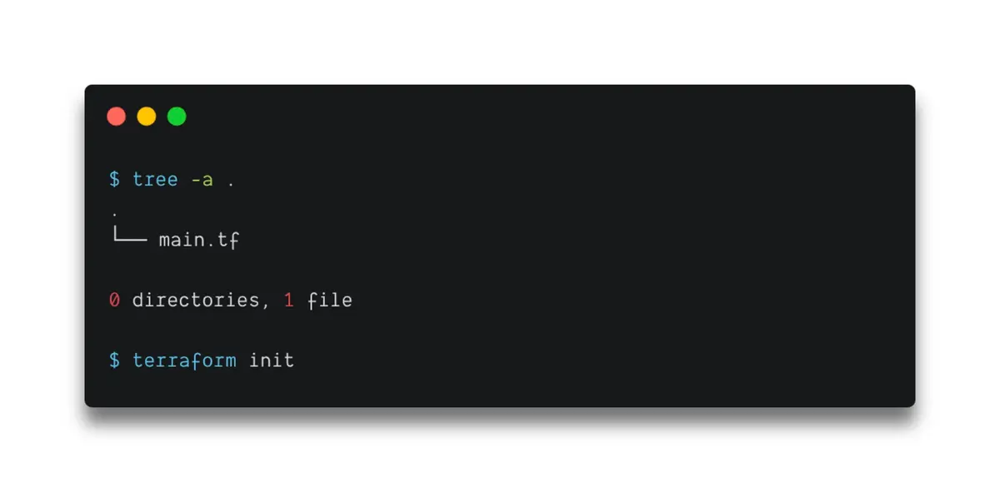
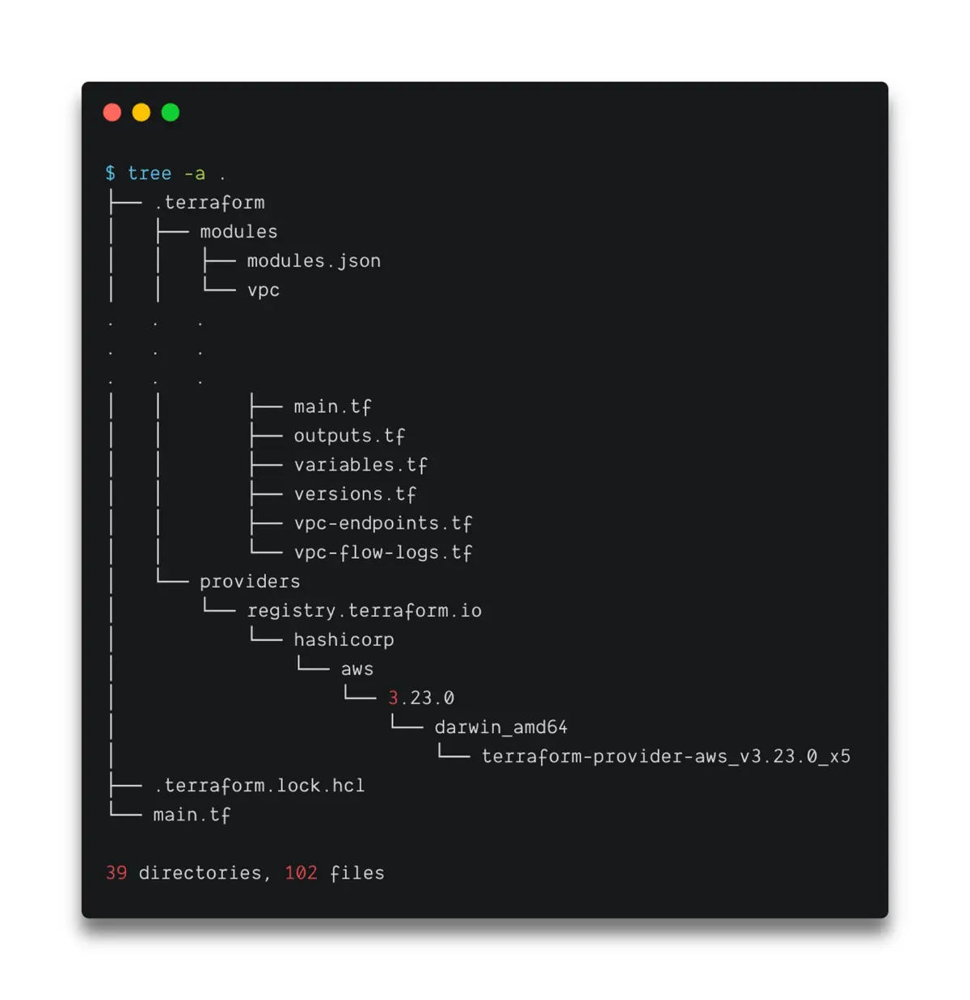

# Terraform Providers & `init` — How Terraform Prepares a Workspace

> **Course:** DevOps Directive — Terraform: Beginner to Pro

> **Section:** Part 3.1 (Basic Terraform Usage — Providers & Init)

> **Goal:** Understand what providers are, why they matter, and what `terraform init` *actually* does behind the scenes.

> **Date:** 01/02/2026
---

## 1. Terraform’s Repeating Command Lifecycle

As Terraform usage scales, the same lifecycle repeats again and again:

* `terraform init` — prepare the workspace
* `terraform plan` — calculate differences
* `terraform apply` — execute changes
* `terraform destroy` — remove managed resources

This is not a tutorial sequence — it is Terraform’s **operating rhythm**.

Terraform is designed around **reconciliation**, not ad‑hoc execution.

---

## 2. Terraform Architecture (Mental Model Refresher)

Terraform is split into two major parts:

### a) Terraform Core

Terraform Core is the engine that:

* Parses configuration files
* Reads the Terraform state file
* Determines what changes are required
* Produces a plan of actions

Terraform Core **does not know how to talk to AWS, Azure, or any cloud by itself**.

---

### b) Terraform Providers

Providers are plugins that:

* Translate Terraform’s abstract resource definitions
* Into real API calls for a specific service

Examples:

* AWS provider → AWS APIs
* Azure provider → Azure APIs
* Cloudflare provider → Cloudflare APIs

Providers are what make Terraform **cloud‑agnostic**.

---

## 3. Terraform Provider Registry

All official and community providers live at:

* registry.terraform.io

Providers can be **official** or **community‑maintained**

Terraform is open‑source, so:

* Anyone can write a provider
* You can even write your own provider if needed

---

## 4. Declaring Providers in Terraform Code

Providers are declared in the `terraform` block using:

* Provider source (namespace)
* Provider version constraint

Why version pinning matters:

* Prevents unexpected breaking changes
* Makes infrastructure behavior reproducible
* Keeps environments consistent across machines and teammates

Terraform treats providers like **dependencies**, not built‑ins.

---

## 5. What `terraform init` Actually Does

`terraform init` is **not optional**.

It prepares the directory to become a Terraform workspace.

Conceptually, `init` performs the following actions:

### a) Downloads Provider Plugins

* Reads required providers from configuration
* Downloads provider binaries from the Terraform registry
* Stores them locally in the workspace

Terraform does *not* download providers globally — they are workspace‑specific.

---

### b) Creates the `.terraform/` Directory
Before Init - 

After `init`, a hidden directory appears:

* `.terraform/`

After Init -  

Inside this directory:

* Provider binaries
* Registry metadata
* Downloaded modules (if used)

This directory is **generated**, not hand‑written.

---

### c) Creates the Dependency Lock File

Terraform also creates:

* `.terraform.lock.hcl`

Purpose of the lock file:

* Records exact provider versions
* Ensures consistent dependency resolution
* Similar in spirit to `package-lock.json`

This file **should be committed to version control**.

---

### d) Prepares Module Dependencies (If Any)

If modules are referenced:

* Terraform downloads module source code
* Stores it under `.terraform/modules/`

Modules are reusable Terraform code bundles.
(Deep dive comes later.)

---

## 6. Important Observations About `init`

* `terraform init` does **not** create infrastructure
* It does **not** contact cloud APIs for resources
* It prepares Terraform to *understand* the configuration

Without `init`:

* Terraform cannot plan
* Terraform cannot apply
* Providers do not exist locally

`init` turns a folder into a **Terraform workspace**.

---

## 7. Mental Model to Lock In

* Terraform Core = decision engine
* Providers = translators
* Registry = provider marketplace
* `.terraform/` = local execution environment
* `.terraform.lock.hcl` = dependency contract

Terraform behaves like a **dependency‑driven system**, not a CLI script.

---