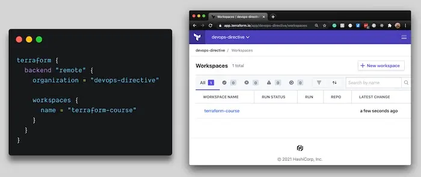
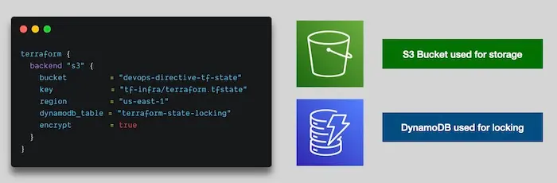

# Remote Terraform Backends — Terraform Cloud vs S3 + DynamoDB

> **Course:** DevOps Directive — Terraform: Beginner to Pro

> **Section:** Part 3.4 (Remote Backends)

> **Goal:** Understand why remote backends exist, the two primary options, and how Terraform bootstraps its own backend safely.

> **Date:** 01/02/2026

---

## 1. Why Remote Backends Matter (Recap)

Terraform state is:

* Critical
* Sensitive
* Shared

Once more than one person or system interacts with Terraform, **local state breaks down**.

Remote backends solve:

* Collaboration
* Security
* Automation
* Concurrency

---

## 2. Two Primary Remote Backend Options

Terraform supports many backends, but in practice two dominate:

1. Terraform Cloud (managed by HashiCorp)
2. Self-managed object storage (commonly AWS S3 + DynamoDB)

---

## 3. Terraform Cloud (Managed Backend)

### What it is

* Official managed offering from HashiCorp
* Terraform state hosted by HashiCorp
* Permissions, locking, and history handled for you

---

### How it Works Conceptually

* You create:

  * An **organization**
  * One or more **workspaces**
* Terraform backend is configured as `remote`
* State lives entirely in Terraform Cloud

Execution no longer depends on a single developer machine.



---

### Advantages

* Very easy to get started
* Built-in state locking
* Web UI for visibility
* Free for up to **5 users per organization**

---

### Disadvantages

* Costs $20 per user per month beyond 5 users
* Less control compared to self-managed backends
* Vendor lock-in concerns for some teams

Terraform Cloud is how HashiCorp monetizes Terraform.

---

## 4. Self-Managed Backend (AWS S3 + DynamoDB)

### What it is

* Terraform state stored in an S3 bucket
* State locking handled by a DynamoDB table

This approach is extremely common in AWS-based teams.



---

### Responsibilities of Each Component

**S3 Bucket**

* Stores the Terraform state file
* Should have:

  * Encryption enabled
  * Versioning enabled

**DynamoDB Table**

* Used only for state locking
* Prevents concurrent `apply` operations
* Uses atomic locking guarantees

---

## 5. Why State Locking Is Necessary

Without locking:

* Two engineers could run `terraform apply` at the same time
* State could be corrupted
* Infrastructure could diverge

With DynamoDB locking:

* Only one apply can run at a time
* Others are blocked until completion

This protects Terraform from race conditions.

---

## 6. The Bootstrapping Problem (Chicken & Egg)

Problem:

* Terraform needs an S3 bucket and DynamoDB table to store state
* But Terraform itself is supposed to provision infrastructure

Question:

* How do we provision the backend **before** the backend exists?

Answer:

* Bootstrapping

---

## 7. Bootstrapping Process (Step-by-Step Conceptual)

### Step 1: Start With Local Backend

* Do NOT configure a remote backend initially
* Terraform defaults to local state

---

### Step 2: Define Backend Infrastructure as Resources

* Define:

  * S3 bucket for state storage
  * DynamoDB table for locking

Critical detail:

* DynamoDB hash key **must be named `LockID`**

---

### Step 3: Apply Using Local Backend

* Run normal Terraform apply
* This provisions:

  * S3 bucket
  * DynamoDB table

At this point:

* Backend infrastructure exists
* State is still local

---

### Step 4: Switch Backend Configuration

* Update Terraform configuration
* Enable S3 backend with:

  * Bucket name
  * Key (path inside bucket)
  * Region
  * DynamoDB table
  * Encryption enabled

---

### Step 5: Re-run Terraform Init

* Terraform detects backend change
* Prompts to migrate state
* You confirm

Terraform then:

* Uploads local state to S3
* Enables DynamoDB locking

From this point onward:

* State is remote
* Local state is no longer authoritative

---

## 8. Key Observations About Bootstrapping

* Bootstrapping happens **once per project**
* After migration, backend resources are managed like any other Terraform resources
* Terraform can manage its own backend safely after initialization

---

## 9. Terraform Cloud vs S3 — How to Choose

Use Terraform Cloud when:

* You want minimal setup
* Team is small
* You value convenience over control

Use S3 + DynamoDB when:

* You want full control
* You already use AWS heavily
* You want cost predictability
* You plan to integrate CI/CD deeply

---

```t
terraform {
  #############################################################
  ## AFTER RUNNING TERRAFORM APPLY (WITH LOCAL BACKEND)
  ## YOU WILL UNCOMMENT THIS CODE THEN RERUN TERRAFORM INIT
  ## TO SWITCH FROM LOCAL BACKEND TO REMOTE AWS BACKEND
  #############################################################
  # backend "s3" {
  #   bucket         = "devops-directive-tf-state" # REPLACE WITH YOUR BUCKET NAME
  #   key            = "03-basics/import-bootstrap/terraform.tfstate"
  #   region         = "us-east-1"
  #   dynamodb_table = "terraform-state-locking"
  #   encrypt        = true
  # }

  required_providers {
    aws = {
      source  = "hashicorp/aws"
      version = "~> 3.0"
    }
  }
}

provider "aws" {
  region = "us-east-1"
}

resource "aws_s3_bucket" "terraform_state" {
  bucket        = "devops-directive-tf-state" # REPLACE WITH YOUR BUCKET NAME
  force_destroy = true
}

resource "aws_s3_bucket_versioning" "terraform_bucket_versioning" {
  bucket = aws_s3_bucket.terraform_state.id
  versioning_configuration {
    status = "Enabled"
  }
}

resource "aws_s3_bucket_server_side_encryption_configuration" "terraform_state_crypto_conf" {
  bucket        = aws_s3_bucket.terraform_state.bucket
  rule {
    apply_server_side_encryption_by_default {
      sse_algorithm = "AES256"
    }
  }
}

resource "aws_dynamodb_table" "terraform_locks" {
  name         = "terraform-state-locking"
  billing_mode = "PAY_PER_REQUEST"
  hash_key     = "LockID"
  attribute {
    name = "LockID"
    type = "S"
  }
}
```
