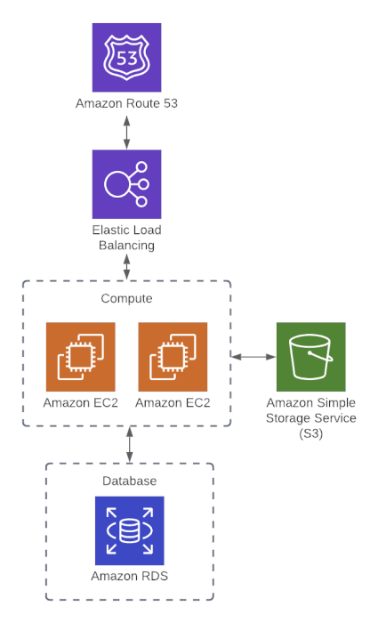

# Sample Terraform Configuration Walkthrough (End-to-End AWS Web App)

> **Course:** DevOps Directive — Terraform: Beginner to Pro

> **Goal:** Understand how Terraform provisions a *realistic, multi-resource AWS architecture* end-to-end.

> **Date:** 01/02/2026

---

## Purpose of This Section

This lesson demonstrates how **multiple AWS resources work together** when defined using Terraform.

**Important framing:**

* ❌ This is **not** an AWS deep-dive
* ✅ This *is* a Terraform orchestration exercise

The configuration is intentionally **naive**:

* Everything lives in a single `main.tf`
* Many values are hardcoded
* No variables, outputs, or modules yet

This is deliberate. Later sections will refactor this into production-grade Terraform.

---

## High-Level Architecture



The Terraform configuration provisions a complete web application stack:

* **2 EC2 instances** (compute)
* **Application Load Balancer (ALB)**
* **Security Groups** (network access control)
* **S3 bucket** (object storage – demo purpose)
* **Route 53** (DNS)
* **RDS PostgreSQL instance** (database)
* **Remote Terraform backend (S3 + DynamoDB)**

### Traffic Flow

User → Route 53 DNS → Load Balancer → EC2 Instance 1 or 2

---

## Terraform Backend (Remote State)

This configuration uses a **remote backend**:

* State stored in **S3**
* Locking handled by **DynamoDB**

**Key ideas:**

* State is no longer local
* Enables collaboration
* Enables CI/CD
* Prevents concurrent `terraform apply`

The backend configuration lives inside the top-level `terraform {}` block.

---

## Provider Configuration

The AWS provider is explicitly configured:

* Provider source pinned (`hashicorp/aws`)
* Version constrained (`~> 3.0`)
* Region specified (`us-east-1`)

**Why this matters:**

* Predictable behavior
* Reproducible builds
* No accidental provider upgrades

---

## Compute Layer — EC2 Instances

Two EC2 instances are provisioned:

* Same Ubuntu 20.04 AMI
* Same instance type (`t2.micro` in demo)
* Same security group

### User Data

Each instance runs a startup script that:

* Writes a unique message to `index.html`
* Starts a Python HTTP server on port `8080`

**Instance responses:**

* Instance 1 → `Hello, World 1`
* Instance 2 → `Hello, World 2`

This makes load balancing visually obvious.

---

## Object Storage — S3 Bucket

An S3 bucket is provisioned to demonstrate persistent storage.

**Configuration highlights:**

* Bucket prefix used (ensures unique name)
* Versioning enabled
* Server-side encryption enabled (AES256)

Although unused by the app, this mirrors real-world designs where:

* Files live in S3
* Metadata lives in a database

---

## Referencing Existing Infrastructure (Data Sources)

Instead of creating a new VPC:

* Default VPC is referenced using a `data` block
* Default subnets are fetched dynamically

**Why use `data` blocks?**

* Terraform reads but does NOT manage these resources
* Prevents accidental deletion
* Safer for shared infrastructure

---

## Security Groups & Rules

Security groups define **allowed traffic**.

### EC2 Security Group

* Inbound TCP traffic on port `8080`
* Open to `0.0.0.0/0` (demo only)

### Load Balancer Security Group

* Inbound HTTP traffic on port `80`
* Allows all outbound traffic

> Security groups answer: *Who can talk to what, and on which ports?*

---

## Load Balancer (Traffic Distribution)

An **Application Load Balancer** is configured with:

* Listener on port `80` (HTTP)
* Default 404 response
* Target group pointing to EC2 instances on port `8080`
* Health checks on `/`

**Result:**

* Refreshing the page alternates responses
* Confirms traffic is split across instances

---

## DNS — Route 53

Route 53 is used to expose the app via a real domain:

* Hosted Zone created
* A-record points domain → Load Balancer

**Operational notes:**

* Nameservers must be updated at the domain registrar
* DNS propagation may take time

Once propagated:

* Domain resolves to ALB
* Traffic flows correctly to instances

---

## Database Layer — RDS

A PostgreSQL RDS instance is provisioned:

* Engine: PostgreSQL 12
* Instance class: `db.t2.micro`
* Credentials hardcoded (demo only)
* No final snapshot (simplifies teardown)

The app does **not** connect to the DB.

**Purpose:**

* Demonstrate Terraform managing managed services

---

## Execution Flow

Commands executed:

* `terraform init` → Initialize backend + providers
* `terraform plan` → Shows ~17 resources to be created
* `terraform apply` → Provisions infrastructure

**Observations:**

* EC2 and ALB provision quickly
* RDS is slowest

---

## Cleanup

After validation:

* `terraform destroy`
* Deletes all 17 resources
* Prevents unnecessary AWS billing

⚠️ Never run `destroy` on live production infrastructure.

---

## Key Takeaways

* Terraform can provision **entire architectures**, not just single resources
* Resource dependencies are inferred automatically
* Remote state is critical for real teams

This configuration will be **refactored later** using:

* Variables
* Outputs
* Multiple files
* Modules
* Cleaner structure

---

## Terraform Configuration — Full Reference

### Backend Configuration

```
terraform {
  # Assumes s3 bucket and dynamo DB table already set up
  # See /code/03-basics/aws-backend
  backend "s3" {
    bucket         = "devops-directive-tf-state"
    key            = "03-basics/web-app/terraform.tfstate"
    region         = "us-east-1"
    dynamodb_table = "terraform-state-locking"
    encrypt        = true
  }
}
```

### Provider Configuration

```
terraform {
  required_providers {
    aws = {
      source  = "hashicorp/aws"
      version = "~> 3.0"
    }
  }
}

provider "aws" {
  region = "us-east-1"
}
```

### EC2 Instances & Security Group

```
resource "aws_instance" "instance_1" {
  ami             = "ami-011899242bb902164"
  instance_type   = "t2.micro"
  security_groups = [aws_security_group.instances.name]
  user_data       = <<-EOF
              #!/bin/bash
              echo "Hello, World 1" > index.html
              python3 -m http.server 8080 &
              EOF
}

resource "aws_instance" "instance_2" {
  ami             = "ami-011899242bb902164"
  instance_type   = "t2.micro"
  security_groups = [aws_security_group.instances.name]
  user_data       = <<-EOF
              #!/bin/bash
              echo "Hello, World 2" > index.html
              python3 -m http.server 8080 &
              EOF
}

resource "aws_security_group" "instances" {
  name = "instance-security-group"
}
```

### S3 Bucket

```
resource "aws_s3_bucket" "bucket" {
  bucket_prefix = "devops-directive-web-app-data"
  force_destroy = true
}

resource "aws_s3_bucket_versioning" "bucket_versioning" {
  bucket = aws_s3_bucket.bucket.id
  versioning_configuration {
    status = "Enabled"
  }
}

resource "aws_s3_bucket_server_side_encryption_configuration" "bucket_crypto_conf" {
  bucket = aws_s3_bucket.bucket.bucket
  rule {
    apply_server_side_encryption_by_default {
      sse_algorithm = "AES256"
    }
  }
}
```

### Default VPC & Subnets

```
data "aws_vpc" "default_vpc" {
  default = true
}

data "aws_subnet_ids" "default_subnet" {
  vpc_id = data.aws_vpc.default_vpc.id
}
```

### Security Group Rule

```
resource "aws_security_group_rule" "allow_http_inbound" {
  type              = "ingress"
  security_group_id = aws_security_group.instances.id

  from_port   = 8080
  to_port     = 8080
  protocol    = "tcp"
  cidr_blocks = ["0.0.0.0/0"]
}
```

### Load Balancer

```
resource "aws_lb_listener" "http" {
  load_balancer_arn = aws_lb.load_balancer.arn
  port = 80
  protocol = "HTTP"
  default_action {
    type = "fixed-response"
    fixed_response {
      content_type = "text/plain"
      message_body = "404: page not found"
      status_code  = 404
    }
  }
}

resource "aws_lb_target_group" "instances" {
  name     = "example-target-group"
  port     = 8080
  protocol = "HTTP"
  vpc_id   = data.aws_vpc.default_vpc.id
  health_check {
    path                = "/"
    protocol            = "HTTP"
    matcher             = "200"
    interval            = 15
    timeout             = 3
    healthy_threshold   = 2
    unhealthy_threshold = 2
  }
}

resource "aws_lb_target_group_attachment" "instance_1" {
  target_group_arn = aws_lb_target_group.instances.arn
  target_id        = aws_instance.instance_1.id
  port             = 8080
}

resource "aws_lb_target_group_attachment" "instance_2" {
  target_group_arn = aws_lb_target_group.instances.arn
  target_id        = aws_instance.instance_2.id
  port             = 8080
}

resource "aws_lb_listener_rule" "instances" {
  listener_arn = aws_lb_listener.http.arn
  priority     = 100
  condition {
    path_pattern {
      values = ["*"]
    }
  }
  action {
    type             = "forward"
    target_group_arn = aws_lb_target_group.instances.arn
  }
}

resource "aws_security_group" "alb" {
  name = "alb-security-group"
}

resource "aws_security_group_rule" "allow_alb_http_inbound" {
  type              = "ingress"
  security_group_id = aws_security_group.alb.id
  from_port   = 80
  to_port     = 80
  protocol    = "tcp"
  cidr_blocks = ["0.0.0.0/0"]
}

resource "aws_security_group_rule" "allow_alb_all_outbound" {
  type              = "egress"
  security_group_id = aws_security_group.alb.id
  from_port   = 0
  to_port     = 0
  protocol    = "-1"
  cidr_blocks = ["0.0.0.0/0"]
}

resource "aws_lb" "load_balancer" {
  name               = "web-app-lb"
  load_balancer_type = "application"
  subnets            = data.aws_subnet_ids.default_subnet.ids
  security_groups    = [aws_security_group.alb.id]
}
```

### Route 53

```
resource "aws_route53_zone" "primary" {
  name = "devopsdeployed.com"
}

resource "aws_route53_record" "root" {
  zone_id = aws_route53_zone.primary.zone_id
  name    = "devopsdeployed.com"
  type    = "A"
  alias {
    name                   = aws_lb.load_balancer.dns_name
    zone_id                = aws_lb.load_balancer.zone_id
    evaluate_target_health = true
  }
}
```

### RDS Instance

```
resource "aws_db_instance" "db_instance" {
  allocated_storage = 20
  auto_minor_version_upgrade = true
  storage_type               = "standard"
  engine                     = "postgres"
  engine_version             = "12"
  instance_class             = "db.t2.micro"
  name                       = "mydb"
  username                   = "foo"
  password                   = "foobarbaz"
  skip_final_snapshot        = true
}
```
