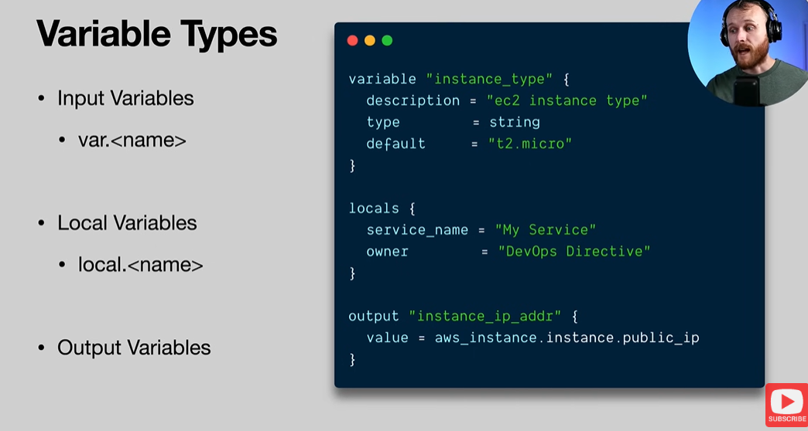

# Part 4.1 — Terraform Variables & Outputs (Core Concepts)

> **Course:** DevOps Directive — Terraform: Beginner to Pro

> **Objective:** Understand how Terraform uses variables and outputs to make configurations flexible, reusable, and composable.

> **Date:** 03-02-2026

---

## Why Variables & Outputs Matter

While the previous example demonstrated how Terraform can provision an entire web application architecture end-to-end, it also revealed a key limitation:

* Many values were **hardcoded**
* The configuration was **rigid**
* Reuse across environments (dev / staging / prod) was difficult

Terraform variables and outputs are features of **HashiCorp Configuration Language (HCL)** that solve this problem.

A useful mental model:

* **Input variables** → function parameters
* **Resources** → function body
* **Output variables** → return values

---

## Types of Variables in Terraform

Terraform supports three major variable concepts:

1. Input Variables
2. Local Variables
3. Output Variables

Each serves a distinct purpose and scope.



---

## 1. Input Variables

Input variables allow you to **pass values into Terraform at runtime**.

They are referenced using:

```
var.variable_name
```

### Concept

Input variables are analogous to **function arguments**.

Instead of hardcoding values (like instance sizes, AMIs, or domains), you define them once and override them per environment.

### Example Use Case

* Development → small instance
* Production → larger instance

Same code, different inputs.

### Example Input Variable Definition

```
variable "instance_type" {
  type    = string
  default = "t2.micro"
}
```

This variable can now be referenced anywhere in the configuration using:

```
var.instance_type
```

---

## 2. Local Variables

Local variables are **internal helper values** scoped to the Terraform configuration.

### Key Characteristics

* Declared using `locals {}` (plural)
* Referenced using `local.name`
* Cannot be overridden at runtime

Think of locals as **temporary variables inside a function**.

### Why Use Locals?

They help to:

* Remove duplication
* Improve readability
* Centralize repeated values

### Example Local Variables

```
locals {
  service_name = "web-app"
  owner        = "devops-team"
}
```

These values can be reused across multiple resources.

---

## 3. Output Variables

Output variables act like **return values** from Terraform.

They allow Terraform to:

* Expose values after `apply`
* Share data between configurations
* Enable composition of Terraform projects

### Example Output Variable

```
output "instance_ip" {
  value = aws_instance.instance_1.public_ip
}
```

Outputs can be:

* Viewed after `terraform apply`
* Consumed by other Terraform configurations or modules

---

## Variable Value Assignment — Precedence Order

Terraform allows multiple ways to assign values to input variables. These methods follow a **strict order of precedence** (lowest → highest):

1. Interactive CLI prompt
2. Default value in variable block
3. Environment variables (`TF_VAR_name`)
4. `terraform.tfvars` file
5. `*.auto.tfvars` files
6. `-var` or `-var-file` flags (highest precedence)

### Important Note

If a variable:

* Has no default
* Is not provided anywhere

Terraform will prompt for it interactively. This is **not recommended** for reproducible workflows.

---

## TF_VAR Environment Variables

Variables can be supplied using environment variables with the prefix:

```
TF_VAR_<variable_name>
```

Example:

```
TF_VAR_db_pass=super_secret_password
```

This approach is commonly used in:

* CI/CD pipelines
* Secure deployment environments

---

## tfvars Files

Terraform supports defining variables in files such as:

* `terraform.tfvars`
* `*.auto.tfvars`

These are typically used for:

* Environment-specific values
* Non-sensitive configuration

### Example tfvars File

```
bucket_prefix = "devops-directive-web-app-data"
domain        = "devopsdeployed.com"
db_name       = "mydb"
db_user       = "foo"
```

⚠️ Sensitive values should **not** be stored in tfvars files.

---

## Passing Variables at Runtime

The highest-precedence method is passing variables directly via CLI:

```
terraform apply \
  -var "db_user=my_user" \
  -var "db_pass=super_secure"
```

This overrides all other definitions.

---

## Variable Types

Terraform supports multiple data types.

### Primitive Types

* `string`
* `number`
* `bool`

### Complex Types

* `list`
* `set`
* `map`
* `object`

Terraform performs **automatic type checking** and fails early if mismatches occur.

---

## Validation Rules

Terraform allows defining custom validation rules on variables.

Purpose:

* Catch misconfigurations early
* Enforce constraints
* Add static checks before provisioning

This improves safety and predictability.

---

## Sensitive Variables

Sensitive data (e.g., passwords) are often passed via variables.

Best practices:

* Mark variables as `sensitive = true`
* Avoid storing secrets in files

### Example

```
variable "db_pass" {
  type      = string
  sensitive = true
}
```

Terraform will mask sensitive values in plan and apply output.

---

## External Secret Stores

Terraform can integrate with external secret managers such as:

* AWS Secrets Manager
* HashiCorp Vault

Secrets can be:

* Retrieved securely
* Passed into variables
* Used without leaking values into logs or state outputs

---

## Applying Variables to the Web App Configuration

Variables replace hardcoded values in the earlier web app example.

### Example: EC2 Variables

```
variable "ami" {
  description = "Amazon machine image to use for ec2 instance"
  type        = string
  default     = "ami-011899242bb902164"
}

variable "instance_type" {
  description = "ec2 instance type"
  type        = string
  default     = "t2.micro"
}
```

### Referencing Variables in Resources

```
resource "aws_instance" "instance_1" {
  ami             = var.ami
  instance_type   = var.instance_type
  security_groups = [aws_security_group.instances.name]
  user_data       = <<-EOF
              #!/bin/bash
              echo "Hello, World 1" > index.html
              python3 -m http.server 8080 &
              EOF
}
```

---

## Outputs in Practice

Outputs expose useful runtime information:

```
output "instance_1_ip_addr" {
  value = aws_instance.instance_1.public_ip
}
```

These values can be used by:

* Humans (inspection)
* Other Terraform modules
* Automation workflows

---

## Key Takeaways

* Variables eliminate hardcoding
* Locals improve readability and maintainability
* Outputs enable composition
* Precedence rules matter
* Sensitive data must be protected

Variables and outputs transform Terraform from **scripts** into **systems**.

---
