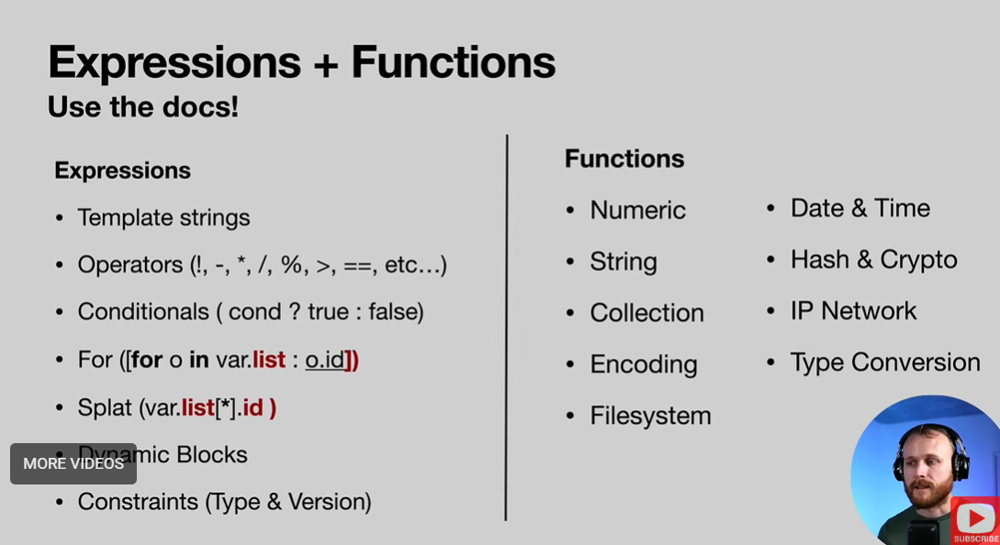
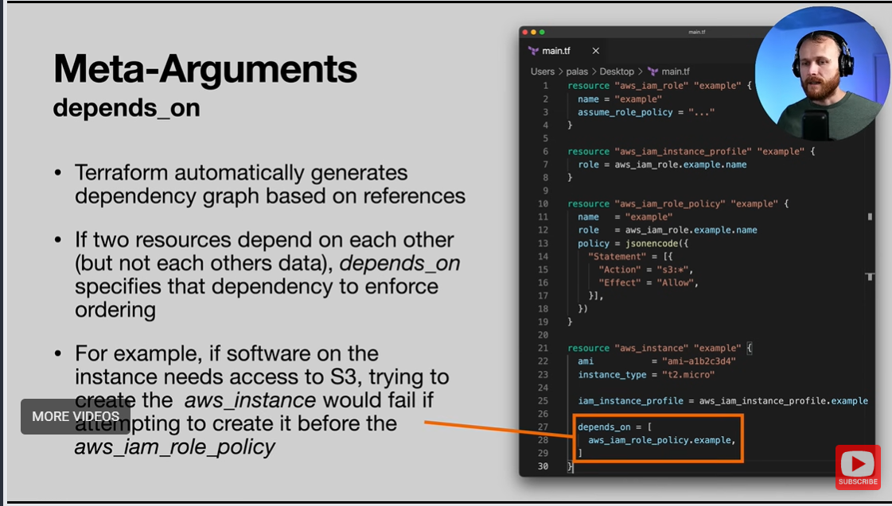
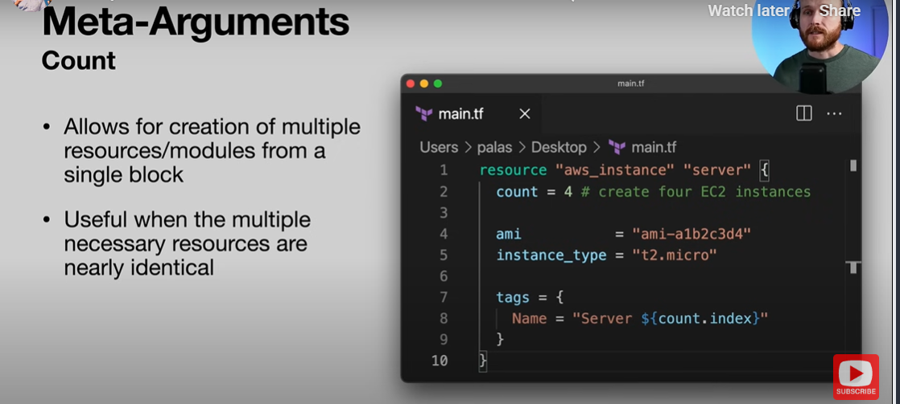
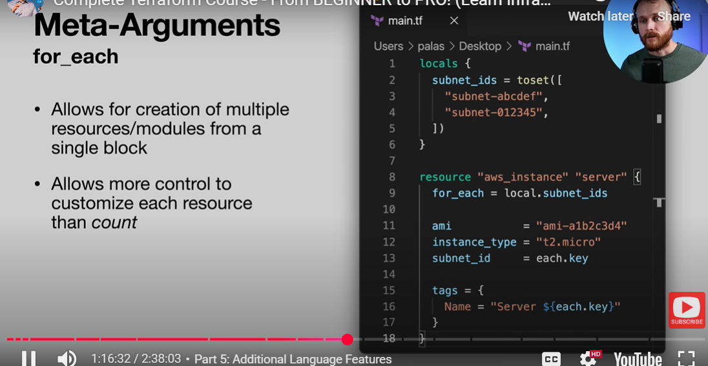
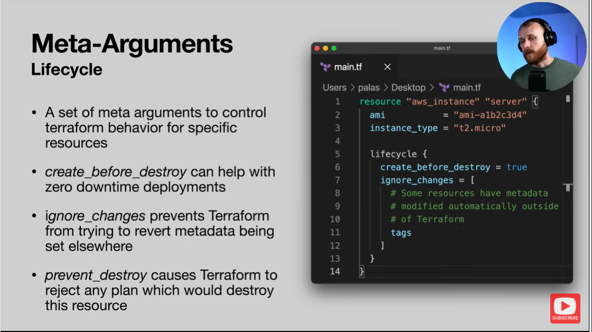
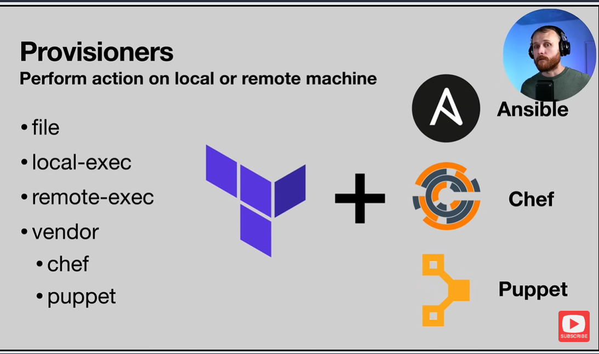

# Part 5.1 — Additional HCL Language Features

> **Goal:** Understand advanced HashiCorp Configuration Language (HCL) features that make Terraform configurations more expressive, modular, and production-ready.
>
> **Important mindset:** This section is *awareness + patterns*, not memorization. The Terraform docs are the source of truth.
>
> **Date:** 07-02-2026

---

## Why This Section Exists

Up to this point, you’ve:

* Built real infrastructure
* Refactored it using variables & outputs
* Made it reusable across environments

Now we zoom out and learn **language-level tools** that help:

* Reduce duplication
* Express intent clearly
* Handle conditional logic
* Control creation order and behavior

These features become critical once configurations grow beyond toy examples.

---

## HCL Expressions

Terraform supports rich expressions similar to programming languages.

### Template Strings

Used to build strings dynamically using variables or expressions:

```
"hello-${var.environment}"
```

Very common for:

* Resource names
* Tags
* Identifiers

---

### Operators

Terraform supports standard operators:

* Arithmetic: `+ - * / %`
* Comparison: `> >= < <= == !=`
* Logical: `&& || !`

Used inside expressions and conditionals.

---

### Conditional Expressions (Ternary)

Syntax:

```
condition ? true_value : false_value
```

Example:

```
var.environment == "prod" ? "t3.large" : "t3.micro"
```

Extremely useful for:

* Environment-based configuration
* Optional resources
* Cost optimization

---

### For Expressions

Allow iteration over collections without duplicating code.

Used for:

* Generating lists
* Transforming maps
* Creating dynamic values

Helps avoid copy-paste infrastructure.

---

### Splat Expressions

Used to **expand values from a list of resources**.

Example mental model:

> “Give me all of these attributes from all instances.”

Common with:

* Multiple instances
* Outputs

---

### Other Expression Types (Awareness)

* Dynamic blocks
* Type constraints
* Version constraints

These appear more as configs scale or modules are introduced.

---

## Functions

Terraform has many built-in functions.

### Categories

* Numeric (math)
* String manipulation
* Date & time
* Hash & crypto
* Encoding / decoding
* Type conversion

Examples:

```
lower("HELLO")
join(",", ["a", "b", "c"])
format("server-%02d", 1)
```

Functions help remove hardcoding and manual formatting.

---

## Meta-Arguments

Meta-arguments control **how Terraform behaves**, not *what* it creates.

They apply to resources and modules.

---

### depends_on

Used when Terraform cannot automatically infer dependencies.

Example use case:

* EC2 instance requires IAM policy to exist
* No direct reference in config

```
depends_on = [aws_iam_role_policy.example]
```

This gives Terraform a **hint** for correct ordering.

---

### count

Used to create multiple identical resources.

```
count = 4
```

Access index with:

```
count.index
```

Also useful for conditionals:

```
count = var.enable_feature ? 1 : 0
```

---

### for_each

More powerful alternative to `count`.

Instead of indexes, it iterates over actual values.

```
for_each = toset(["a", "b", "c"])
```

Access values with:

```
each.key
each.value
```

Preferred when:

* Resources need unique identifiers
* Order should not matter

---

### lifecycle

Controls how Terraform creates, updates, or destroys resources.

#### create_before_destroy

```
create_before_destroy = true
```

Ensures:

* Replacement happens before deletion
* Minimizes downtime

---

#### ignore_changes

Used when external systems modify resources automatically.

```
ignore_changes = [tags]
```

Prevents Terraform from constantly fighting the provider.

---

#### prevent_destroy

```
prevent_destroy = true
```

Acts as a **safety lock**.

Terraform will refuse to destroy the resource, even if commanded.

---

## Provisioners

Provisioners run actions **after** a resource is created.

Types:

* `file`
* `local-exec`
* `remote-exec`
* Vendor-specific (e.g., Ansible)

Examples:

* Uploading scripts
* Running setup commands
* Triggering configuration management

⚠️ **Best practice:**

* Use provisioners sparingly
* Prefer baked images, user data, or configuration tools

---

## Key Takeaways

* HCL is a real language, not just config
* Expressions reduce duplication
* Meta-arguments control behavior & safety
* `for_each` > `count` for most real use cases
* Docs are your best reference for edge cases

----------

# Hashicorp Configuration Language Features

The official documentation is the best reference for these: https://www.terraform.io/docs/language/index.html


## Expressions

### Strings
```py
"foo" # literal string

"foo ${var.bar}" # template string
```

### Operators
```py
# Order of operations: 
!, - # (multiplication by -1)
*, /, % # (modulo)
+, - # (subtraction)
>, >=, <, <= # (comparison)
==, != # (equality)
&& # (AND)
|| # (OR)
```

### Conditionals

Ternary syntax can be used to conditionally set values based on other values.

```py
condition ? true_val : false_val

# For example
var.a != "" ? var.a : "default-a"
```

## Functions
```py
# Numeric
abs()
ceil()
floor()
log()
max()
parseint() # parse as integer
pow()
signum() # sign of number

# string
chomp() # remove newlines at end
format() # format number
formatlist()
indent()
join()
lower()
regex()
regexall()
replace()
split()
strrev() # reverse string
substr()
title()
trim()
trimprefix()
trimsuffix()
trimspace()
upper()
```
### Other function types:
- Colleciton
- Encoding
- Filesystem
- Date & Time
- Hash & Crypto
- IP Network
- Type Conversion

## Meta-arguments

Special arguments to control the behavior of resources and/or modules

### depends_on

Allows specifying dependencies which do not manifest directly through consumption of data from another resource. For example if the creation order of two resources matters, the latter can be specified to depend on the former.

### count

Allows for creation of multiple of a particular resource or module. This is most useful if each instance configuration is nearly identical.

`count.index` can be referenced for each resource.

`Count = 0` can also be used to prevent creation of a resource or modules. This is usually used in conjunction with conditional expression to selectively determine if the resource needs to be created.

### for_each

Also allows for multiple of a particular resource or module but allows for more control across the instances by iterating over a list.

```json
resource "some_resource" "example" {
  for_each = toset( ["foo", "bar", "baz"] )
  name     = each.key
}
```

This would create three copies of `some_resource` with the name set to `"foo"`, `"bar"`, and `"baz"` respectively

### lifecycle

Lifecycle meta-arguments control how Terraform treats particular resources.

#### create_before_destroy

Specifying `create_before_destroy = true` indicates that if the resource does need to be destroyed, Terraform should first provision its replacement before destroying the deprecated resource. This can be useful for things such as zero downtime deployments.

```json
resource "some_resource" "example" {
  # ...

  lifecycle {
    create_before_destroy = true
  }
}
```

#### ignore_changes

Sometimes an entity outside of terraform will automatically modify a resource (e.g. adding metadata, etc...). The `ignore_changes` argument allows you to ignore specific types of resource changes to prevent this from causing Terraform to attempt to revert those changes.

#### prevent_destroy

`prevent_destroy` provides an additional stopgap against accidentally destroying resources with terraform. If set to true, Terraform will reject any attempt to destroy that resource.

```py
resource "aws_instance" "example" {

  # ...

  depends_on = [aws_iam_role_policy.example]
}
```

```py
resource "aws_instance" "example" {

  # ...

  count = 4
  tags = {
    Name = "server-${count.index + 1}"
  }
}
```

### for_each

`for_each` is similar to count, but it provides more control over each resource. It allows you to loop through an iterable and create resources based on its values.

```py
locals {
  subnets = ["subnet-abc123", "subnet-def456"]
}

resource "aws_instance" "example" {

  # ...

  for_each = toset(local.subnets)
  subnet_id = each.value
}
```

```py
resource "aws_instance" "example" {

  # ...

  lifecycle {
    create_before_destroy = true
    ignore_changes = [tags]
    prevent_destroy = true
  }
}
```

https://developer.hashicorp.com/terraform/docs













