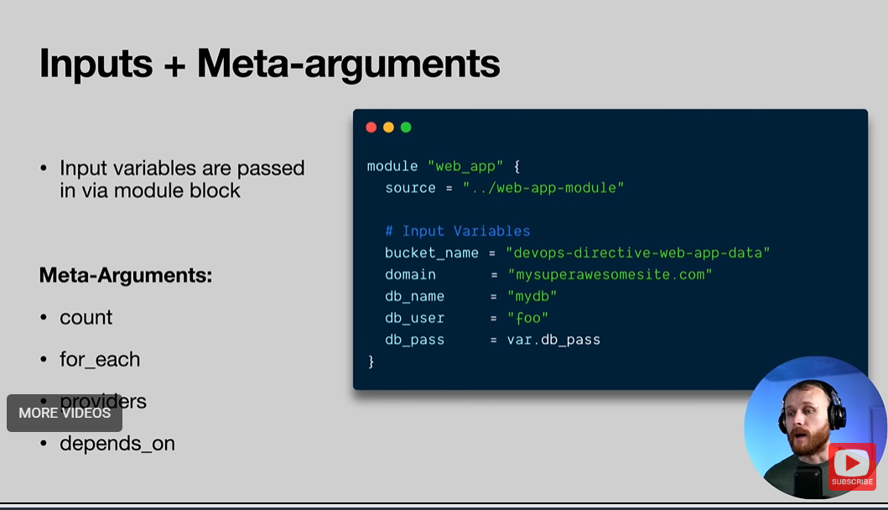

# Part 6.1 — Terraform Project Organization & Modules

> **Goal:** Learn how Terraform modules help organize infrastructure, enable reuse, and allow teams to scale Terraform usage cleanly.

> **Date:** 07-02-2026

---

## Why This Section Exists

Up until now, everything lived in a single root configuration.

That works for:

* Learning
* Small demos

It **does not scale** for:

* Multiple environments (dev / staging / prod)
* Multiple teams
* Reusable infrastructure patterns

Modules are the mechanism Terraform provides to solve this.

---

## What Is a Terraform Module?

A **module** is a container for multiple Terraform resources bundled together in a reusable unit.

Technically:

* A module is **just a directory** containing `.tf` (or `.tf.json`) files
* Terraform treats all `.tf` files in a directory as **one module**

You have *already* been using modules.

### The Default (Root) Module

* Every `.tf` file in your working directory
* This is called the **root module**

So far:

* All lessons used only the root module

Now:

* We break things into **child modules**

---

## Why Use Modules?

Modules allow **separation of concerns**.

Instead of:

* Every developer understanding *everything*

We get:

* Infrastructure specialists → define best practices
* Application developers → consume infrastructure safely

### Real-World Example

Infrastructure team builds a **web-app module** that includes:

* EC2
* Load balancer
* Database
* Networking
* Security rules

Application developer just provides:

* App name
* Domain
* Instance size

No need to understand:

* Terraform internals
* AWS edge cases

---

## Types of Terraform Modules

### 1. Root Module

* The main working directory
* Entry point of Terraform execution

### 2. Child Modules

* Separate modules referenced from the root module
* Encapsulate reusable infrastructure logic

---

## Module Sources

Terraform supports multiple ways to load modules.

### 1. Local Path

Used when modules live in the same repo.

```hcl
module "web_app" {
  source = "../web-app"
}
```

---

### 2. Terraform Registry

Public modules published by the community or vendors.

```hcl
module "consul" {
  source  = "hashicorp/consul/aws"
  version = "0.1.0"
}
```

✔ Always pin versions to avoid breaking changes.

---

### 3. GitHub (HTTPS or SSH)

```hcl
module "example" {
  source = "github.com/hashicorp/example?ref=v1.2.0"
}
```

Or via SSH:

```hcl
module "example" {
  source = "git::ssh://git@github.com/hashicorp/example.git?ref=v1.2.0"
}
```

---

### 4. Generic Git Repository

```hcl
module "example" {
  source = "git::ssh://username@example.com/storage.git"
}
```

Used for:

* Private repos
* Internal company modules

---

## Module Inputs



Child modules can expose **input variables**, just like root modules.

```hcl
module "web_app" {
  source        = "./modules/web-app"
  domain        = "example.com"
  instance_type = "t3.micro"
}
```

This allows:

* One generic module
* Many different deployments

---

## Meta-Arguments with Modules

Modules support meta-arguments too:

* `count`
* `for_each`
* `providers`
* `depends_on`

Example:

```hcl
module "web_app" {
  source = "./modules/web-app"
  count  = 2
}
```

---

## What Makes a Good Terraform Module?

Not all modules are good modules.

### Characteristics of a Useful Module

1. **Raises abstraction level**

   * Not a thin wrapper over one resource

2. **Logical grouping**

   * Resources that belong together

3. **Clear input variables**

   * Only what consumers actually need

4. **Sensible defaults**

   * Works out-of-the-box

5. **Useful outputs**

   * IPs, endpoints, IDs, ARNs

---

## Outputs from Modules

Modules should return values needed by other systems.

```hcl
output "alb_dns_name" {
  value = aws_lb.this.dns_name
}
```

Consumed as:

```hcl
module.web_app.alb_dns_name
```

---

## Terraform Registry

The Terraform Registry hosts:

* Providers
* Modules

For example:

* AWS VPC modules
* Security group modules
* ECS / EKS modules

These are excellent:

* Starting points
* Reference implementations

But:

* Always read the source
* Always pin versions

---

## Key Takeaways

* Modules are Terraform’s **primary scaling mechanism**
* They enable reuse, safety, and team specialization
* Root modules orchestrate
* Child modules encapsulate