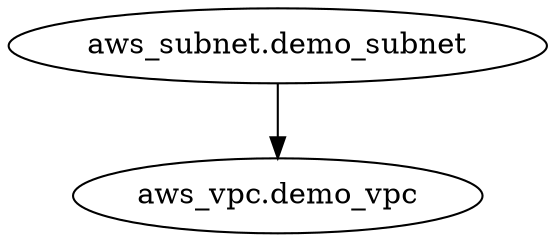

# Day 6 — Step 06: Visualizing the Graph (`terraform graph`)

**Date:** February 12, 2026  
**Phase:** DevOps Lock-In — Phase 2 (Terraform)  
**Theme:** Seeing the DAG instead of imagining it  
**Environment:** AWS provider + multiple resources

---

## 🎯 Objective of This Step

Stop imagining the dependency graph.

Actually see what Terraform builds internally.

By the end of this step, I must:

* Generate Terraform’s dependency graph
* Understand what the output represents
* Identify nodes and edges
* Confirm implicit & explicit dependencies visually
* Trust the graph model completely

---

## 🧠 Core Mental Model

Terraform internally builds a DAG.

`terraform graph` simply prints that DAG.

It does **NOT**:

* Change infrastructure
* Modify state
* Call cloud APIs

It only:

> Outputs Terraform’s internal graph representation.

---

## 🧪 Step 06A — Generate the Graph

Run:

```bash
terraform graph
```

You will see something like:



This is Graphviz **DOT format**.

---

## 🧠 Understanding the Output

Each line represents:

```
child → parent
```

Meaning:

> Child depends on parent.

If you see:

```
aws_subnet.demo_subnet -> aws_vpc.demo_vpc
```

It means:

* Subnet depends on VPC
* VPC must exist first

---

## 🔍 Nodes in the Graph

Nodes include:

* Resources
* Data sources
* Providers
* Root module
* Outputs
* Implicit internal nodes

Terraform’s graph is bigger than just your resources.

---

## 🧱 Step 06B — Visualize It Properly (Optional but Powerful)

If Graphviz is installed:

```bash
terraform graph | dot -Tpng > graph.png
```

Then open:

```
graph.png
```

You’ll see the DAG visually.

---

## 🔥 What to Look For

When viewing the graph:

* VPC should be a parent node
* Subnet & SG should point to VPC
* Independent buckets should have no edges
* `depends_on` should create explicit edges

If you created a cycle earlier,
Terraform will refuse to generate the graph.

---

## 🧠 Important Insight

The graph shows:

* Execution ordering
* Parallelizable sections
* Explicit vs implicit dependencies
* Hidden internal structure

This confirms:

> Terraform is not procedural.  
> It is structural.

---

## 🧪 Step 06C — Modify and Re-Visualize

Try:

* Remove `depends_on`
* Add `depends_on`
* Remove references
* Add new references

Run:

```bash
terraform graph
```

Observe how edges change.

This proves:

> Graph structure changes execution behavior.

---

## 🧠 Advanced Understanding

Terraform builds different graph types:

* Plan graph
* Apply graph
* Destroy graph

Destroy graph is reversed.

That’s why destroy works safely.

---

## 🔥 Major Realization

At this point:

Terraform is no longer magical.

It is:

* Parse config
* Build DAG
* Compare with state
* Schedule graph execution
* Update state

Everything revolves around the graph.

---

## 🚫 What This Step Is NOT

This is **NOT** about:

* Fancy visualization
* Pretty diagrams

It is about:

> Verifying your mental model matches Terraform’s actual graph.

---

## ✅ End Condition for Step 06

This step is complete only if I can:

* Generate and interpret `terraform graph`
* Identify dependency edges visually
* Confirm parallelizable resources
* Explain how graph structure controls execution

---

# https://dreampuf.github.io/GraphvizOnline/